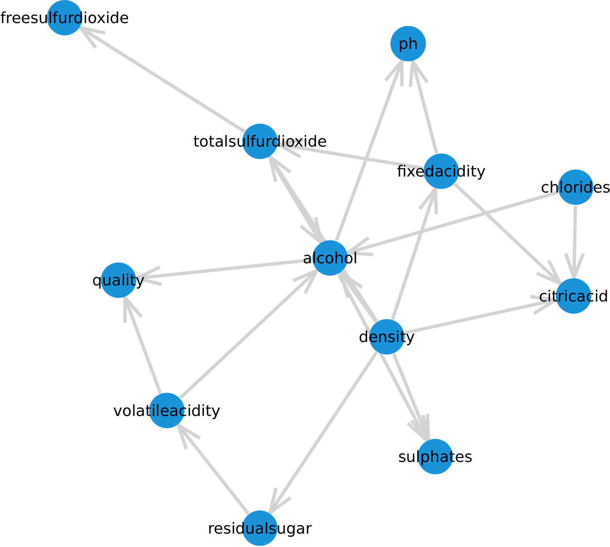
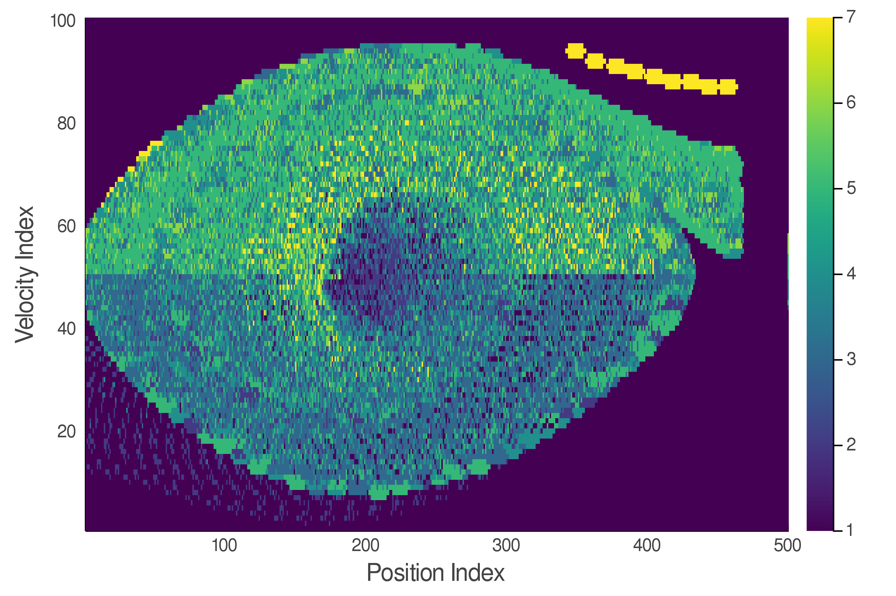

# aa-228

my workspace for AA 228: decision making under uncertainty

projects: [project 1](https://github.com/rbalexan/aa-228/tree/master/project-1) | [project 2](https://github.com/rbalexan/aa-228/tree/master/project-2) | [final project](https://github.com/rbalexan/aa-228/tree/master/final-project) 

---

#### [project 1 | Bayesian structure learning](https://github.com/rbalexan/aa-228/tree/master/project-1/):

> A maximum likelihood approach to Bayesian structure learning assuming a uniform graph prior and a uniform Dirichlet network parameter prior (Bayesian-Dirichlet (BD) scoring). For a given graph structure, a dataset is read, counted, and scored using the Bayesian scoring function. Algorithms for maximizing the Bayesian score using directed graph search have been implemented.

- Bayesian score ([`bayesianCounts.jl`](https://github.com/rbalexan/aa-228/tree/master/project-1/bayesianCounts.jl) and [`bayesianScore.jl`](https://github.com/rbalexan/aa-228/tree/master/project-1/bayesianScore.jl))
- K2 directed graph search ([`singleK2Search.jl`](https://github.com/rbalexan/aa-228/tree/master/project-1/singleK2Search.jl)) with random restarts ([`multiK2Search.jl`](https://github.com/rbalexan/aa-228/tree/master/project-1/multiK2Search.jl)) 
- additional documentation ([`readme.pdf`](https://github.com/rbalexan/aa-228/tree/master/project-1/doc/README.pdf))

 <b>Bayesian network computed using 100 randomized restarts of K2 search</b> 

---

#### [project 2 | reinforcement learning](https://github.com/rbalexan/aa-228/tree/master/project-2/):

>An implementation of various dynamic programming and approximate dynamic programming algorithms for Markov decision processes (MDPs) in a batch reinforcement learning setting. Included algorithms are value iteration, Gauss-Seidel value iteration, sarsa($\lambda$), sarsa($\lambda$) with natural annealing, sarsa($\lambda$) with local approximation, sarsa($\lambda$) with global approximation via Fourier series expansion, and modal policy updating.

- maximum-likelihood estimate of transition and reward models ([`inferTransitionAndReward.jl`](https://github.com/rbalexan/aa-228/tree/master/project-2/inferTransitionAndReward.jl))
- value iteration ([`valueIteration.jl`](https://github.com/rbalexan/aa-228/tree/master/project-2/valueIteration.jl)) and Gauss-Seidel value iteration (assumed ordering) ([`valueIteration.jl`](https://github.com/rbalexan/aa-228/tree/master/project-2/valueIterationGaussSeidel.jl))
- sarsa with eligibility traces (sarsa($\lambda$)) ([`sarsaLambdaLearning.jl`](https://github.com/rbalexan/aa-228/tree/master/project-2/sarsaLambdaLearning.jl)), with natural annealing ([`sarsaLambdaLearningProportionate.jl`](https://github.com/rbalexan/aa-228/tree/master/project-2/sarsaLambdaLearningProportionate.jl)), local approximation ([`sarsaLambdaLearningLocalApproximation.jl`](https://github.com/rbalexan/aa-228/tree/master/project-2/sarsaLambdaLearningLocalApproximation.jl)), global approximation ([`sarsaLambdaLearningGlobalApproximation.jl`](https://github.com/rbalexan/aa-228/tree/master/project-2/sarsaLambdaLearningGlobalApproximation.jl))
- modal policy updating ([`modalPolicyUpdating.jl`](https://github.com/rbalexan/aa-228/tree/master/project-2/modalPolicyUpdating.jl))
- additional documentation ([`readme.pdf`](https://github.com/rbalexan/aa-228/tree/master/project-2/doc/README.pdf))

 <b>Optimal policy in the phase space representation using Gauss-Seidel value iteration and modal policy update</b> 

---

#### [final project | dynamic pricing in the airline industry using reinforcement learning](https://github.com/rbalexan/aa-228/tree/master/final-project):

> Dynamic pricing in the airline industry demonstrates some of the most effective pricing schemes in business to maximize revenue based on customers' willingness to pay for particular goods at particular times. We propose to develop a dynamic pricing reinforcement learning algorithm to maximize revenue for a single flight with multiple customer segments. We suggest reinforcement learning as it is a model-free paradigm and thus less sensitive to unusual demand patterns, and because it is a relatively new approach to dynamic pricing for airlines.

---